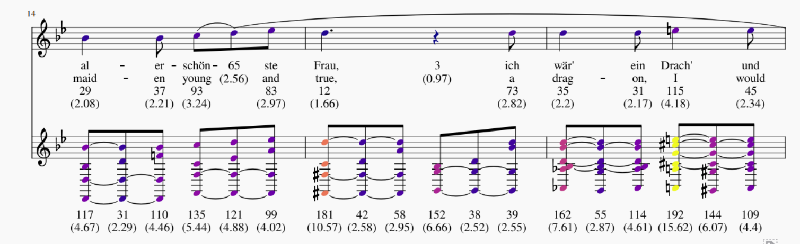

# Annotate Score

This repo contains code that annotates a music score (in XML format) with colours for each note based on a slices file. A slices file contains information about particular time intervals in a musical score.

An example of a part of the score of Der Verzweifelte Liebhaber coloured and ranked by information theoretic surprisal (as estimated by a language model).


========================================

It is highly recommended to run

`python -m music21.configure`

before using.

=========================================

Requirements:
- matplotlib, music21
- musescore3
- a png viewer

Make sure to set all the music21 settings correctly. Most importantly the musicXML, png and show settings. Here is an example.

```
musicxmlPath:              /usr/bin/musescore3

graphicsPath:              /usr/bin/eog

musescoreDirectPNGPath:    /usr/bin/musescore3

showFormat:                png

ipythonShowFormat:         ipython.musicxml.png`
```

Files:
- `analyze_base.py`         contains the class that annotates the scores
- `annotate.py`             is a script that performs annotation on 1 file passed as commandline arguments
- `musicentropy_shell.py`   is a currently depreciated interactive shell for viewing scores and slices side by side
- `slices.tsv` & `score.mxl`  are a sample to test the code on

The colormap used is matplotlib's "plasma", but all colormaps from matplotlib should work and can be easily changed when running the code (https://matplotlib.org/tutorials/colors/colormaps.html).

